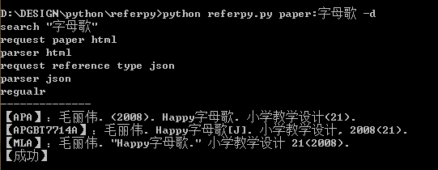

# ReferPy
在论文写作中，参考文献是非常重要的一部分，但是花费过多时间在参考文献的格式上，往往得不偿失。本项目利用[百度学术](http://xueshu.baidu.com/)的查询功能，通过Http请求。<br>
当前接口支持获取百度学术所提供的**所有**[参考文献格式]()：
* [APA](https://baike.baidu.com/item/APA%E6%A0%BC%E5%BC%8F/1647900)<br>
	American Psychological Association, 是美国心理学会出版的《美国心理协会刊物准则》。APA格式是一个为广泛接受的研究论文撰写格式，特别针对社会科学领域的研究。
* [MLA](https://baike.baidu.com/item/MLA/1197673?fr=aladdin)<br>
	Modern Language Association, 美国现代语言协会制定的论文指导格式，在一般书写英语论文时应当使用MLA格式来保证学术著作的完整。
* [GB/T 7714](https://wenku.baidu.com/view/83139309f7ec4afe05a1df19.html)<br>
	《文后参考文献著录规则》 是一项专门供著者和编辑编撰文后参考文献使用的国家标准。 
<br>
后期有时间会支持Google学术，知网等更其他搜索引擎，也会建设Web网站，提供查询接口。

## 一、安装
本项目是通过Python脚本编写的，在Windows系统下需要配置Python环境：
* Python<br>
	请点击[这里](https://www.python.org/downloads/)查看安装列表。尽量采用Python3.6及其以上版本(本项目开发环境采用Python 3.7.0a4).请在安装时选择`添加环境变量`<br>
	安装完毕后请在`命令行`用以下命令测试安装是否成功，若安装成功则返回版本信息：
	```
	>>Python -V
	```
	若安装成功，但是没有返回版本信息，则很可能是没有添加环境变量所致。请添加`<Python安装目录>`和`<Python安装目录>/Scripts/`至环境变量
* BeautifulSoup<br>
	这是一个Python的第三方工具包，用于对html网页进行解析。通过python的pip工具包可以进行自动下载安装。在`命令行`下通过下述命令进行安装：
	```
	>>pip install beautifulsoup4
	```
	若提示找不到pip的错误，则可能是没有添加pip所在的环境变量。pip的环境变量为安装目录下的Scripts文件夹：`<Python安装目录>/Scripts/`
* ReferPy
	下载ReferPy压缩文件，在你愿意的地方解压即可。
	
## 二、接口
ReferPy的接口的使用是通过命令行，需要先进入ReferPy所在的目录`cd <ReferPy解压目录>`, 再通过python调用其接口进行查询：
```
>>python refer.py <paper> [-DEBUG|-debug|-D|-d]
```
ReferPy将会发起http请求访问百度学术，并获得解析返回的结果。注意，由于需要联网，因此要确保`网络环境畅通`。

### *1.直接查询*
ReferPy在`命令行`中直接输入一个指定论文，并在`命令行`直接显示该论文的参考文献格式：
```
>>python referpy.py paper:"A data hiding scheme based upon DCT coefficient modification"
```
将会查询论文A data hiding scheme based upon DCT coefficient modification的参考文献格式，如下图所示：

### *2.批量查询*
批量生成是不会直接将查询结果输出到命令行的，而是将结果批量输出到`ReferPy的目录`下的apa.txt, gbt7714.txt, mla.txt文件中，每个文件保存对应类型的参考文献格式。<br>
批量查询分了两种, `文件查询`和`目录查询`:
* 文件查询<br>
	在文件中一行记录一个待查询的论文题目，只要交给referpy该文件的路径，需要注意的是保存的文件需要为`UTF8`就会在`ReferPy的目录`下批量生成结果:
	```
	# D:/papers.txt(实际使用时不应该有该行)
	A data hiding scheme based upon DCT coefficient modification
	A Novel Steganography Algorithm Based on Motion Vector and Matrix Encoding
	基于运动矢量的H.264信息隐藏算法
	```
	<br>
	最终结果将会以文件中论文顺序进行排列输出，并给其编号：
	```
	# <ReferPyDir>/apa.txt(使用中不会生成该行)
	[1] Lin, Y. K. (2014). A data hiding scheme based upon dct coefficient modification. Computer Standards & Interfaces, 36(5), 855-862. 
	[2] Hao-Bin, Zhao, L. Y., & Zhong, W. D. (2011). A novel steganography algorithm based on motion vector and matrix encoding. IEEE, International Conference on Communication Software and Networks (pp.406-409). IEEE. 
	[3] 苏育挺, 张新龙, 张承乾, & 张静. (2014). 基于运动矢量的h.264信息隐藏算法. 天津大学学报（自然科学与工程技术版）(1), 67-73. 
	
	# <ReferPyDir>/mla.txt(使用中不会生成该行)
	[1] Lin, Yih Kai. "A data hiding scheme based upon DCT coefficient modification." Computer Standards & Interfaces 36.5(2014):855-862. 
	[2] Hao-Bin, L. Y. Zhao, and W. D. Zhong. "A novel steganography algorithm based on motion vector and matrix encoding." IEEE, International Conference on Communication Software and Networks IEEE, 2011:406-409. 
	[3] 苏育挺等. "基于运动矢量的H.264信息隐藏算法." 天津大学学报（自然科学与工程技术版） 1(2014):67-73. 
	
	# <ReferPyDir>/gbt7714.txt(使用中不会生成该行)
	[1] Lin Y K. A data hiding scheme based upon DCT coefficient modification[J]. Computer Standards & Interfaces, 2014, 36(5):855-862. 
	[2] Hao-Bin, Zhao L Y, Zhong W D. A novel steganography algorithm based on motion vector and matrix encoding[C]// IEEE, International Conference on Communication Software and Networks. IEEE, 2011:406-409. 
	[3] 苏育挺, 张新龙, 张承乾,等. 基于运动矢量的H.264信息隐藏算法[J]. 天津大学学报（自然科学与工程技术版）, 2014(1):67-73. 
	```
* 目录查询<br>
	若文件夹中已经有了所有的文献(文件名就是文献名)，而你并不希望手动将文献名称全部敲入txt文件中时，可以使用目录查询:
	目录中有以下文件：<br>
	<br>
	<br>
	最终结果同样会被编号，且是以论文题目的字典顺序进行排序的。
	```
	# <ReferPyDir>/apa.txt(使用中不会生成该行)
	[1] Lin, Y. K. (2014). A data hiding scheme based upon dct coefficient modification. Computer Standards & Interfaces, 36(5), 855-862. 
	[2] Hao-Bin, Zhao, L. Y., & Zhong, W. D. (2011). A novel steganography algorithm based on motion vector and matrix encoding. IEEE, International Conference on Communication Software and Networks (pp.406-409). IEEE. 
	[3] 苏育挺, 张新龙, 张承乾, & 张静. (2014). 基于运动矢量的h.264信息隐藏算法. 天津大学学报（自然科学与工程技术版）(1), 67-73. 
	
	# <ReferPyDir>/mla.txt(使用中不会生成该行)
	[1] Lin, Yih Kai. "A data hiding scheme based upon DCT coefficient modification." Computer Standards & Interfaces 36.5(2014):855-862. 
	[2] Hao-Bin, L. Y. Zhao, and W. D. Zhong. "A novel steganography algorithm based on motion vector and matrix encoding." IEEE, International Conference on Communication Software and Networks IEEE, 2011:406-409. 
	[3] 苏育挺等. "基于运动矢量的H.264信息隐藏算法." 天津大学学报（自然科学与工程技术版） 1(2014):67-73. 
	
	# <ReferPyDir>/gbt7714.txt(使用中不会生成该行)
	[1] Lin Y K. A data hiding scheme based upon DCT coefficient modification[J]. Computer Standards & Interfaces, 2014, 36(5):855-862. 
	[2] Hao-Bin, Zhao L Y, Zhong W D. A novel steganography algorithm based on motion vector and matrix encoding[C]// IEEE, International Conference on Communication Software and Networks. IEEE, 2011:406-409. 
	[3] 苏育挺, 张新龙, 张承乾,等. 基于运动矢量的H.264信息隐藏算法[J]. 天津大学学报（自然科学与工程技术版）, 2014(1):67-73. 
	```
	
### *3.DEBUG模式*
在所有接口最后用`-DEBUG`可以开启调试模式，调试模式中将给出更为详细的信息。为了方便也可以通过`-debug`, `-d`, `-D`启动DEBUG模式：<br>


## 三、FAQ
#### 1.对中文文献的支持
对中文是完全支持的，可以输入中文题目的论文，会输出对应的中文参考文献格式。需要注意的是referpy涉及到中文的地方，全部采用`UTF8`进行编码。若你发现使用过程中存在编码解码问题或是中文乱码问题，那么请注意把编码模式切换为UTF8。

#### 2.论文标题错误
检索具备一定的容错性，会查询和标题`最相似`的结果。需要注意的是，标题输入错误导致时，不会给出任何提示！因此可能`最相似`的结果并非你想要的，最好进行一次人工对标题的排查。

#### 3.论文题目模糊
和上述类似，会查询`最相似`的，当然是`百度学术`认为的最相似。

#### 4.使用是否有次数限制
暂时还未测试出百度学术对于该接口限制的次数